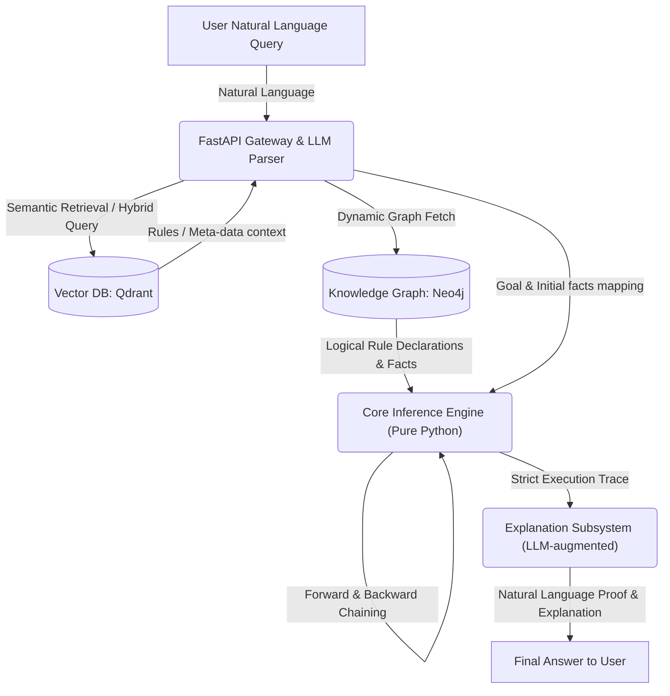

# Omni-IPS: Omni-domain Intelligent Problem Solver

Omni-IPS is a production-ready, state-of-the-art **Neuro-Symbolic AI** and **GraphRAG-powered** Multi-domain Expert System. It seamlessly bridges the structural intuition of deep neural models with the absolute logical correctness of symbolic reasoning kernels.

Omni-IPS is built to operate across three complex, distinct domains: **Chemistry (reactions)**, **Plane Geometry (theorems)**, and **Elementary Algebra (equations)**, using a single, unified, and entirely domain-agnostic symbolic deterministic inference core.

---

## 1. System Architecture: A Neuro-Symbolic & GraphRAG Approach

Omni-IPS decouples the semantic retrieval and mapping of rules from their formal execution, creating a highly modular and robust hybrid logical framework:



### Architectural Subsystems

1. **Knowledge Graph (Neo4j):**
   * Acts as the global **Knowledge Base (KB)** storing the system's "long-term memory".
   * **Nodes:** Represent symbolic `Fact` items (such as chemical elements, geometric angles, or algebraic expressions) and `Rule` definitions.
   * **Edges:** Represent relationships like `:HAS_INPUT` (preconditions) and `:HAS_OUTPUT` (deductions) connecting Rules and Facts.
   * Decoupled Architecture: All rules are dynamically loaded using optimized Cypher queries at runtime rather than being hardcoded in Python.

2. **Vector Database (Qdrant):**
   * Stores high-dimensional semantic embeddings of natural language rule and axiom descriptions.
   * Enables **Semantic Routing** with hard-filtering on domain payloads and **GraphRAG** (Graph Retrieval-Augmented Generation) context injection to help parser agents translate unstructured queries.
   * Dashboard available at `http://localhost:6333/dashboard`.

<p align="center">
  
  <br/>
  <em>Figure 1: Bipartite Neo4j Knowledge Graph display showing Rule nodes connected dynamically to Fact nodes via HAS_INPUT and HAS_OUTPUT relationships.</em>
</p>

3. **Core Inference Engine (Pure Python):**
   * A completely **domain-agnostic** deterministic logical reasoning kernel.
   * Supports **Forward Chaining** (data-driven exploration to deduce everything from initial facts) and **Backward Chaining** (goal-directed proof search starting from the goal).
   * Operates strictly on formal `Fact` and `Rule` abstractions, assuring 100% correctness and eliminating logical hallucinations.

4. **FastAPI Gateway & API Layer:**
   * Serves as the central API service orchestrating requests to the symbolic core, Neo4j connection pool, and Qdrant vector search.

5. **Streamlit Chat UI:**
   * Production-grade web chatbot interface with domain selector, rich response formatting, and LLM-powered educational explanations.

6. **Docker Infrastructure:**
   * Fully containerized and orchestrated services running isolated Neo4j instances, Qdrant endpoints, the Python backend, and the Streamlit frontend in perfect sync.

---

## 2. Directory Layout (Monorepo Blueprint)

The codebase is organized as a clean, modular monorepo utilizing Astral `uv` for lightning-fast and bulletproof dependency management:

```
Omni-IPS/
├── docker-compose.yml          # Container orchestration (Neo4j, Qdrant, Backend, Frontend)
├── Dockerfile                  # Production container definition (optimized with uv)
├── pyproject.toml              # Centralized uv-based project dependencies & environment configuration
├── uv.lock                     # Reproducible package lockfile generated by uv
├── Makefile                    # Unified operation command panel with colored output
├── README.md                   # Comprehensive monorepo system documentation
├── core_engine/                # Unified symbolic engine core
│   ├── __init__.py
│   ├── models.py               # Pydantic validation schemas (Fact, Rule, Trace, InferenceResult)
│   └── solver.py               # Forward & Backward chaining reasoning solvers
├── domains/                    # Extensible domain registrations and syntax adapters
│   ├── __init__.py
│   ├── base.py                 # Abstract base class for DomainParser
│   ├── chemistry/              # Chemistry domain logic
│   │   ├── __init__.py
│   │   └── parser.py           # Chemical formulas and balanced equations parser
│   ├── geometry/               # Plane Geometry domain logic
│   │   ├── __init__.py
│   │   └── parser.py           # Axiomatic geometric theorem parser (with commutative canonicalization)
│   └── algebra/                # Elementary Algebra domain logic
│       ├── __init__.py
│       └── parser.py           # Linear equations and variables parser
├── graph_db/                   # Database driver and session managers
│   ├── __init__.py
│   └── connection.py           # Thread-safe Neo4j connection pool and session context manager
├── data_pipelines/             # Real-world scientific data ingestion & ETL pipelines
│   ├── __init__.py
│   ├── schema.md               # Neo4j Graph database property graph schema
│   ├── ingest_chemistry.py     # Wikidata SPARQL compound extractor + curated textbook reactions ETL
│   └── ingest_geometry.py      # Euclid's "Elements" axioms and propositions ETL
├── api/                        # REST Gateway API endpoints
│   ├── __init__.py
│   └── main.py                 # FastAPI application, CORS middlewares, and solver routes
├── ui/                         # Streamlit Chat Interface
│   └── app.py                  # Production-grade chat UI with domain selector and rich formatting
└── tests/                      # Core test suites
    └── verify_scaffold.py      # Multi-domain integration verification test script
```

---

## 3. Quick Start: Developing with Astral `uv`

Astral `uv` is a blazing-fast, single-binary Python package manager written in Rust, replacing traditional `pip` and `venv` workflows.

### local Prerequisites
* Python 3.10 or higher
* Docker and Docker Compose (optional, for full DB orchestration)
* `uv` Package Manager (automatically installed if missing during `make setup`)

### 1. Project Initialization & Setup
Run the unified setup command. This validates/installs `uv`, initializes a virtual environment in `.venv/`, and installs all production and development dependencies:

```bash
make setup
```

### 2. Run Monorepo Integration Tests
Verify that the core symbolic solvers (Forward and Backward chaining) and domain parsers (Chemistry, Geometry, and Algebra) function perfectly:

```bash
make test
```

### 3. Run Local Development Server
Spin up the FastAPI Gateway API locally. The server automatically reload changes in code:

```bash
make run-server
```

Once started, the interactive OpenAPI documentation is available at:
* **Interactive API docs:** [http://localhost:8080/docs](http://localhost:8080/docs)
* **Health endpoint:** [http://localhost:8080/health](http://localhost:8080/health)

---

## 4. Operational Ingestion & ETL Pipelines (Phase 2)

Omni-IPS prohibits the use of synthetic data generators to prevent hallucinations in rigorous mathematical and chemical reasoning. Instead, real data is ingested via dedicated, robust ETL pipelines:

### 1. Ingestion Pipelines Command Reference

* **Ingest Chemistry Data:** Extract chemical compounds from Wikidata via live SPARQL queries and merge with 20 IUPAC/textbook-verified reactions into Neo4j:
  ```bash
  make ingest-chemistry
  ```
* **Ingest Geometry Data:** Populate the database with 16 fundamental Euclidean plane geometry axioms and theorems (Euclid's Postulates, SAS/ASA/SSS congruence criteria, Pythagorean theorem, Thales's theorem):
  ```bash
  make ingest-geometry
  ```
* **Ingest All Data:** Populate both domains with a single command:
  ```bash
  make ingest-all
  ```

<p align="center">
  
  <br/>
  <em>Figure 2: Qdrant database collections successfully synchronized and partitioned into Chemistry, Geometry, and Algebra rules.</em>
</p>

### 2. Validation & Dry Runs (No Neo4j Needed)
Validate the extraction and transformation stages of the pipelines without having a live Neo4j instance running:

```bash
# Validate chemistry data pipelines
make ingest-chemistry-dry

# Validate geometry data pipelines
make ingest-geometry-dry
```

---

## 5. Docker Orchestration

The entire infrastructure (Neo4j, Qdrant, Python FastAPI backend, and Streamlit frontend) is fully containerized for one-click deployment.

### 1. Launch Containerized Services
To build and spin up the databases and backend service:

```bash
make docker-up
```

This starts:
* **Neo4j Graph Database:** [http://localhost:7474](http://localhost:7474) (Credentials: `neo4j` / `omni_ips_password`)
* **Qdrant Dashboard:** [http://localhost:6333/dashboard](http://localhost:6333/dashboard)
* **FastAPI Backend Service:** [http://localhost:8080](http://localhost:8080)
* **Streamlit Chat UI:** [http://localhost:8501](http://localhost:8501)

### 2. Inspecting and Monitoring
* **View Container Status:** `make docker-status`
* **Tail Service Logs:** `make docker-logs`
* **Stop Services:** `make docker-down`

---

## 6. API Interface Specification

The FastAPI gateway exposes clear endpoints for triggering problem solving and fetching database states.

### `POST /solve` (Execute Inference Solver)
Deduce a solution pathway using Forward or Backward chaining.

#### Request Example (Chemistry Forward Chaining)
```json
{
  "domain": "chemistry",
  "facts": ["Na", "H2O", "HCl"],
  "goal": "NaCl",
  "strategy": "forward"
}
```

#### Response Example
```json
{
  "goal_reached": true,
  "applied_rule_ids": ["r1", "r3"],
  "execution_trace": [
    {
      "rule_id": "r1",
      "fired_rule_repr": "r1 [Sodium Hydration]: Na + H2O -> NaOH + H2",
      "new_facts": ["NaOH", "H2"]
    },
    {
      "rule_id": "r3",
      "fired_rule_repr": "r3 [Neutralization]: NaOH + HCl -> NaCl + H2O",
      "new_facts": ["NaCl"]
    }
  ],
  "known_facts": ["H2", "H2O", "HCl", "Na", "NaCl", "NaOH"]
}
```

### `GET /rules`
Fetch all registered rules inside Neo4j, filtered optionally by domain.
```bash
curl "http://localhost:8080/rules?domain=geometry"
```

---

## 7. Clean Coding, SOLID & Design Patterns

Omni-IPS is engineered in accordance with strict **SOLID design principles**:

* **Single Responsibility Principle (SRP):** The `core_engine/solver.py` is entirely separated from domain-specific notation. Solvers are only responsible for executing logical chaining, while domain parsers manage domain syntax validation.
* **Open/Closed Principle (OCP):** Adding a new reasoning domain (e.g., Classical Physics, Thermodynamics) requires zero modifications to the core engine. Simply sub-class the `DomainParser` abstract base class and register the new parser inside `domains/`.
* **Liskov Substitution Principle (LSP):** All domain parsers extend from `DomainParser` and can be utilized interchangeably by downstream query engines.
* **Interface Segregation Principle (ISP):** Domain-specific values (e.g., molecular masses in chemistry, coordinate points in geometry) are kept inside the dynamic and extensible `attributes` dictionary of the Pydantic `Fact` class, keeping the central interfaces lightweight.
* **Dependency Inversion Principle (DIP):** Reasoning engines and data models communicate strictly through abstract model schemas (`Fact`, `Rule`), keeping them decoupled from low-level database operations.

---

## 8. Advanced Phase 3.5 & 4.x Production Upgrades

To elevate Omni-IPS to a production-grade, bulletproof hybrid AI system, several key technical upgrades were implemented in **Phases 3.5 & 4.x**, eliminating logical variable binding errors, vector DB query drift, database schema blocks, UI latency, and explainability hallucinations:

### 1. Model-Agnostic LLM-Driven Structured Semantic Parser (Phase 3.5)
* **The Problem:** Direct vector similarity search over the entire natural language query was highly inaccurate. Dense embeddings cannot parse strict variable bindings (e.g. mapping `AB, CD, EF` to arbitrary templates), completely failing on multilingual/Vietnamese queries.
* **The Upgrade:** Rewrote `rag_agent/router.py` to use a LangChain model-agnostic chat instance (`get_llm(temperature=0.0)`) and Pydantic schemas (`ExtractedProblem`) to perform deterministic structural parsing.
* **Result:** Successfully extracts exact symbolic fact templates (such as algebraic equations, operation predicates like `Subtract(2,both_sides)`, and geometric relations) from both English and Vietnamese query expressions with zero semantic drift.

### 2. Multi-Tier Qdrant L2 Verification System (Phase 3.5)
* **The Problem:** Fallback vector searches on raw query segments frequently generated weak semantic matches that fell below validation standards, leading to erroneous mappings.
* **The Upgrade:** Implemented a robust 2-level query resolution mapping pipeline in `map_text_to_graph_fact`:
    1. **Level 1 (Exact Payload Scroll):** Executes a rapid scroll filter query in Qdrant targeting either the `value` or `label` payload fields of domain partitions. If an exact match is found, it maps directly with zero overhead.
    2. **Level 2 (High-Confidence Vector Filtering):** If exact matching fails, it falls back to a vector search restricted by a strict threshold condition (`score >= 0.85`), preventing weak matches from leaking into symbolic solvers.

### 3. Dynamic Neo4j Relationship Rule Loader (Phase 3.5)
* **The Problem:** Ingesting domain data in Neo4j via multiple labels (`MERGE (f:Fact:Geometry ...)`) caused constraint errors if a node already existed as a `:Fact` but lacked the domain label. Additionally, pulling rule lists directly from node properties caused `NoneType` iterable join exceptions.
* **The Upgrade:** 
    * Refactored ETL scripts (`ingest_*.py`) to perform singular `MERGE (f:Fact {value: row.value, domain: row.domain})` followed by dedicated `SET f:Domain` Cypher execution.
    * Upgraded API queries to dynamically collect rule preconditions and deductions at runtime from active relationships (`HAS_INPUT` and `HAS_OUTPUT`) with Python-level fallback safety buffers.

### 4. Failed Proof Diagnostic & Pedagogical Explainer (Phase 3.5)
* **The Problem:** The explainability agent assumed that every trace submitted resulted in a successful proof. If a solver failed (`goal_reached = False`), the LLM would hallucinate a fictional path to "prove" the impossible.
* **The Upgrade:** 
    * Extended the `ExplainRequest` API schema and front-end state machinery to pass `goal_reached` directly.
    * Forked `/api/explain` into two distinct cognitive modes: **Success Flow** (rich educational walkthrough of the successful trace) and **Failure Diagnostics Flow** (pedagogical analysis showing mapped facts, steps executed before saturation, and a mathematical analysis explaining the exact logical gap / missing theorems with constructive fixes).

### 5. Seamless Streamlit Hot-Reloading (Phase 3.5)
* **The Problem:** Modifying Streamlit scripts (`ui/app.py`) on the host did not sync to the running UI container because the frontend service ran in isolated context without direct mapping.
* **The Upgrade:** Configured volume mapping (`- .:/app`) inside `docker-compose.yml` for the frontend service, enabling live hot-reloading of UI features alongside backend developments.

### 6. Precise Propositional Alignment & Commutative Canonicalization (Phase 4.1)
* **The Problem:** Naive regex splits truncate inner brackets in nested predicates like `RightAngle(Angle(BAC))`, leading to solver mismatches. Furthermore, symmetric relations like `Parallel(AB, CD)` vs `Parallel(CD, AB)` would fail unification under propositional exact matching.
* **The Upgrades:**
  * **Nested Balanced Parenthesis Parser:** Implemented an $O(N)$ linear-time parser in `domains/geometry.py` that tracks bracket depth to split parameters strictly at the outer nesting level.
  * **Commutative Canonicalization:** Symmetric predicates (`Parallel`, `Perpendicular`, `Congruent`, `Similar`, `Equal`, `Intersect`) automatically have their arguments sorted lexicographically to enforce string consistency.
  * **Pristine Database Sync:** Configured ETL pipelines to clear vector spaces on ingestion, successfully syncing **127 rules and 243 facts** between Neo4j and Qdrant with zero legacy pollution.

### 7. Asynchronous Real-Time Explanation Streaming (Phase 4.2)
* **The Problem:** Serving full educational proof explanations in a single API call caused high-latency freezes, locking the Streamlit chat frame.
* **The Upgrade:** Added an async explain controller (`POST /api/explain/stream`) in the FastAPI backend returning a `StreamingResponse` using LangChain's async stream handler `chain.astream()`.
* **Result:** Streams response chunks chunk-by-chunk in real-time. Streamlit captures the yielded fragments reactively via an async typewriter-like markdown block (`st.write_stream()`), completely eliminating UI lag.

---

## 9. Academic Course Assignment Report

We have compiled a modular, NeurIPS/IEEE-grade **20-page assignment report** for **Applied Knowledge Representation** (Môn học: Biểu diễn tri thức ứng dụng) authored by **Hoang-Khang Nguyen (VNU-HCM University of Science)** detailing the entire mathematical formulation and development process of Omni-IPS:
*   **Master Entrypoint:** `latex_report/main.tex`
*   **Submodules:** `abstract.tex`, `introduction.tex`, `pipelines.tex`, `knowledge_graph.tex`, `rag_router.tex`, `reasoning_engine.tex`, `system_integration.tex`, `evaluation.tex`, `conclusion.tex`, `references.bib`
*   **Compiled PDF Document:** **[main.pdf](latex_report/main.pdf)** (Clickable and viewable locally!)

<p align="center">
  
  
  <br/>
  <em>Figure 3: Side-by-side Streamlit UI showcases displaying the real-time proof explanation of the Pythagorean Converse (left) and Barium Sulfate Precipitation proof steps (right).</em>
</p>

