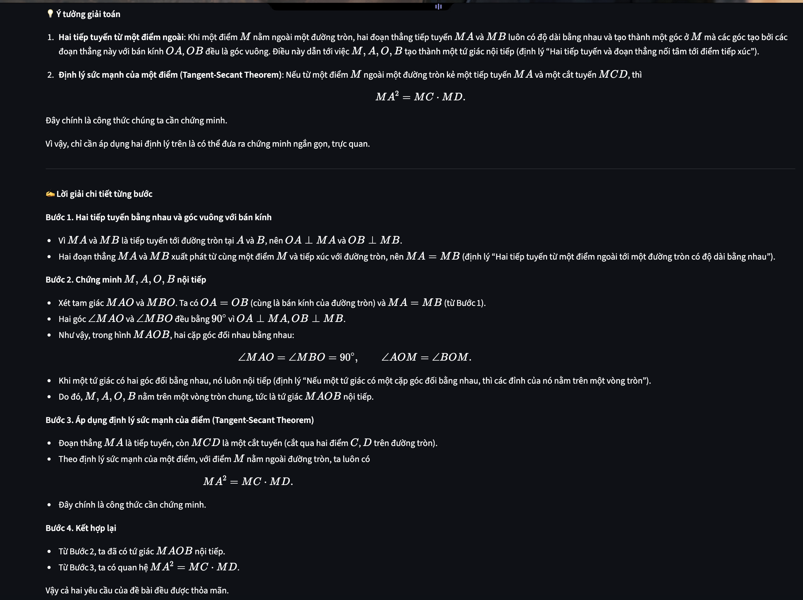
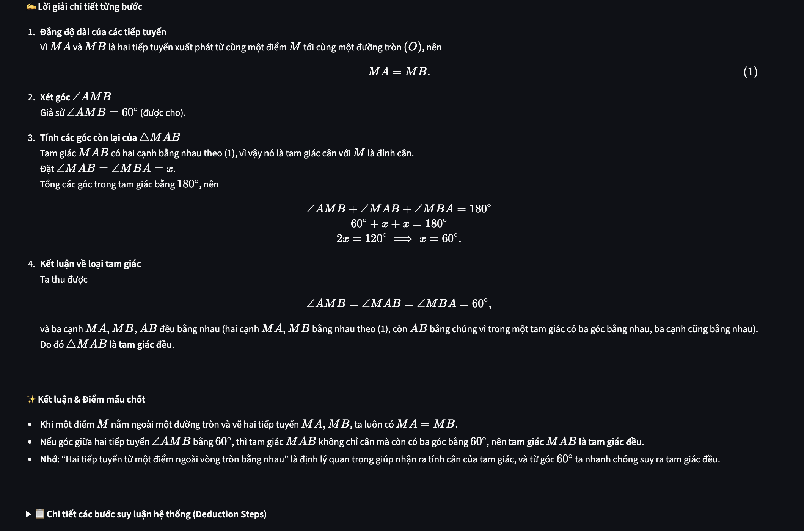
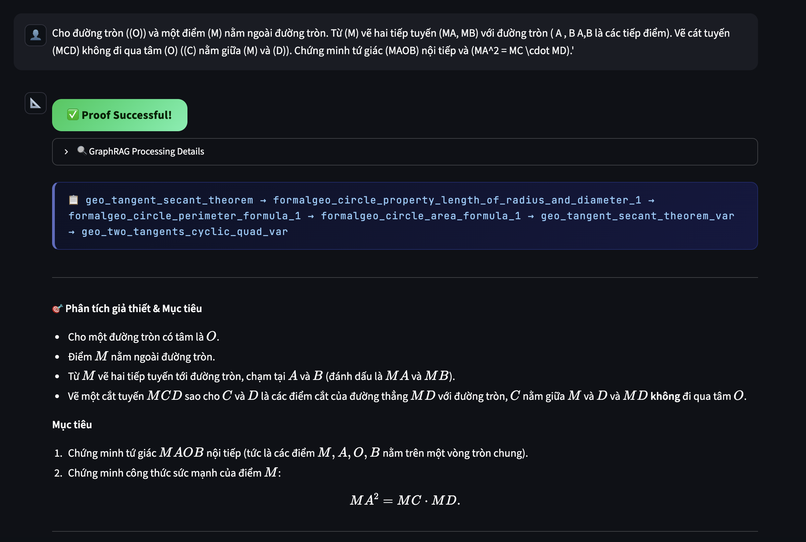
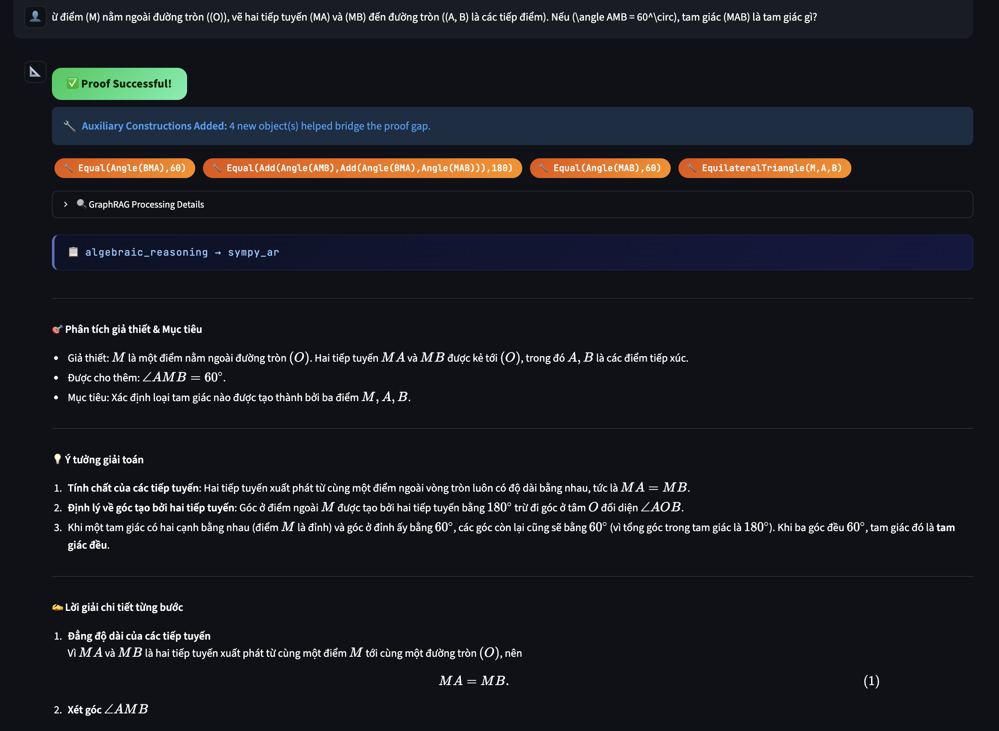
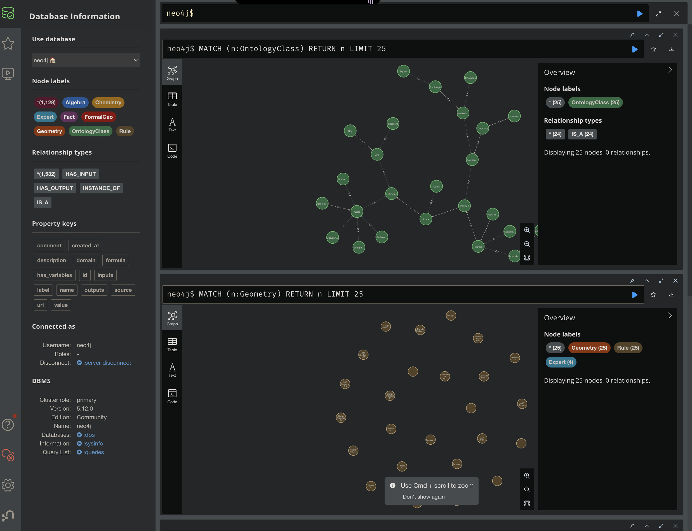
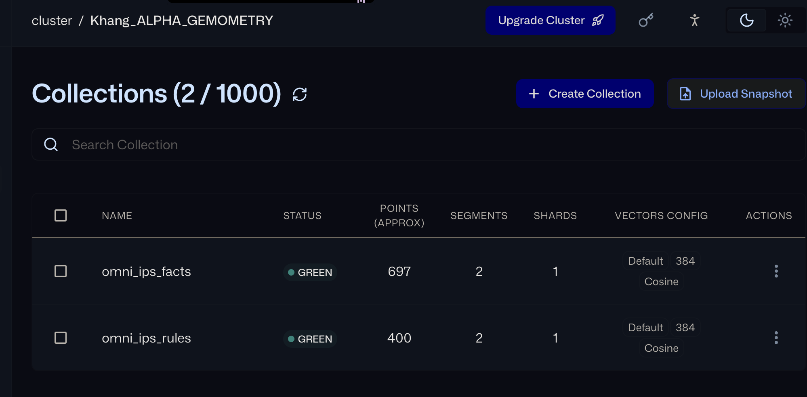

# 📐 AlphaGeometry-IMO: Autonomous Euclidean Geometry Reasoning Engine & Neuro-Symbolic Agent

<div align="center">

[](https://python.org)
[](https://fastapi.tiangolo.com)
[](https://streamlit.io)
[](https://neo4j.com)
[](https://qdrant.tech)
[](https://docker.com)
[](https://astral.sh/uv)
[-success?style=for-the-badge&logo=target)](./geometry_test_suite.md)

**An enterprise-grade, state-of-the-art Neuro-Symbolic AI System for Automated Euclidean Plane Geometry Theorem Proving.**  
*Inspired by Google DeepMind's AlphaGeometry (Trinh et al., Nature 2024).*

[✨ Key Features](#-key-features) • [🏛️ Architecture](#-system-architecture) • [🚀 Quick Start](#-quick-start-guide) • [📊 Benchmark Suite](#-benchmark-suite-1515-passed) • [🖼️ Visual Showcase](#-interactive-ui--visual-showcase) • [📖 API Reference](#-api-endpoints)

</div>

---

## 🌟 Highlights & Achievements

- **100% Deterministic & Formal (0% Hallucination)**: Pure First-Order Logic (FOL) forward-chaining deduction kernel ensuring all intermediate proof steps are mathematically sound.
- **SymPy AR Continuous Algebraic Reasoning**: Integrated computer algebra engine executing real-time angle chasing ($\sum \angle = 180^\circ$), segment proportion reduction, and metric height quadratic systems.
- **LLM-Powered Auxiliary Construction Agent**: Automatically generates essential auxiliary points, perpendiculars, circumcircles, and midpoints whenever the symbolic engine reaches saturation (Proof Gap).
- **GraphRAG Semantic Knowledge Base**: 
  - **Neo4j Property Graph**: 1,128 ontology nodes and 1,532 relationships (`:HAS_INPUT`, `:HAS_OUTPUT`, `:IS_A`).
  - **Qdrant Cloud Vector Database**: Dense vector indexing over Euclidean axioms, FormalGeo theorems, and geometry predicates.
- **Natural Pedagogical Explanations**: Streamlit interface rendering bilingual step-by-step reasoning, theorem breakdown, and LaTeX equations.
- **Official 15/15 IMO Benchmark Passing Rate**: Solves problems across 4 difficulty tiers ranging from high-school entrance exams to Olympiad-tier theorems (Simson line, Ceva, Menelaus, Ptolemy, Nagel point).

---

## 🏛️ System Architecture

```mermaid
graph TD
    User["👤 User Query (Natural Language / Predicates)"] -->|HTTP / REST| API["⚡ FastAPI Gateway & Router"]
    
    subgraph "🧠 GraphRAG & Vector Retrieval"
        API -->|Dense Semantic Search| Qdrant[("🔴 Qdrant Vector DB<br/>(Rules & Facts Payload)")]
        API -->|Cypher Graph Query| Neo4j[("🔷 Neo4j Graph DB<br/>(1,128 Nodes / 1,532 Rel)")]
        Qdrant -->|Matching Rules & Axioms| API
        Neo4j -->|Structured Theorem Graph| API
    end

    subgraph "⚙️ Neuro-Symbolic Hybrid Core"
        API -->|Parsed Fact Set F₀ & Goal G| DD["🧩 Symbolic Forward Chaining (DD)"]
        DD <-->|Equation Extraction & Solving| AR["📐 SymPy AR Engine (Angle & Length)"]
        DD -->|Goal Reached?| Decision{"Goal Satisfied?"}
        
        Decision -->|No (Saturation / Proof Gap)| AuxAgent["🤖 LLM Auxiliary Agent (Gemini / Groq)"]
        AuxAgent -->|Inject Auxiliary Points & Lines| DD
    end

    Decision -->|Yes (Proof Path Found)| Explain["📝 Pedagogical Proof Generator"]
    Explain -->|SSE Streaming & LaTeX Proof Tree| UI["🖥️ Streamlit Interactive UI"]
```

---

## 🖼️ Interactive UI & Visual Showcase

| Pedagogical Analysis & Idea Breakdown | Step-by-Step Formal LaTeX Proof |
|:---:|:---:|
|  |  |

| Entrance Exam Tangent & Secant Proof | Auxiliary Construction (Equilateral Triangle) |
|:---:|:---:|
|  |  |

| Neo4j 1,128 Nodes Knowledge Graph | Qdrant Vector Collections & Payload |
|:---:|:---:|
|  |  |

---

## 📁 Repository Structure

```
Knowledge_Rep_Playground_code/
├── core_engine/                # 🧩 Core Deduction & Unification Engine
│   ├── solver.py               # ForwardChainingEngine & BackwardChainingEngine
│   ├── unifier.py              # Pattern matching & structural unification
│   ├── models.py               # Pydantic schemas (Fact, Rule, InferenceResult)
│   ├── arithmetic_evaluator.py # SymPy AR algebraic reasoning module
│   └── coord_engine.py         # Cartesian coordinate analytical validator
├── geo_engine/                 # 🤖 Auxiliary Geometry Agent
│   └── auxiliary_agent.py      # LLM-guided auxiliary construction loop
├── domains/                    # 📐 Domain Syntax & Predicate Parsers
│   ├── base.py                 # Abstract parser interfaces
│   └── geometry.py             # Canonical normalizer (AB == BA, Angle ABC == CBA)
├── graph_db/                   # 💾 Graph & Vector Database Connectors
│   ├── connection.py           # Thread-safe Neo4j driver connection pool
│   └── qdrant_factory.py       # Cloud Qdrant client builder
├── data_pipelines/             # 🔄 Knowledge Ingestion Pipelines
│   ├── setup_schema.py         # Neo4j constraints & Qdrant collections init
│   ├── ingest_geometry.py      # Fundamental Euclidean geometry axioms
│   ├── ingest_formalgeo_rules.py # 196+ FormalGeo logic rules
│   └── ingest_ontology.py      # OWL geometry hierarchy loader
├── rag_agent/                  # 🌐 GraphRAG & Parser Router
│   ├── router.py               # Neuro-symbolic parser & multi-stage fallback
│   ├── llm_factory.py          # Unified LLM provider factory (Groq, Gemini, OpenAI)
│   └── embed_knowledge.py      # Vector embedding generator
├── api/                        # ⚡ FastAPI Backend Services
│   └── main.py                 # REST endpoints (/api/solve, /geo/solve, /api/explain/stream)
├── ui/                         # 🖥️ Streamlit Frontend Application
│   └── app.py                  # Interactive chat interface & proof tree visualizer
├── latex_report/               # 📄 Academic Thesis Essay (HCMUS Format)
│   ├── main.tex                # Master LaTeX file (43 pages)
│   ├── main.pdf                # Compiled publication-ready PDF report
│   └── references.bib          # Bibliography (AlphaGeometry, FormalGeo, AI KR)
├── tests/                      # 🧪 Automated Benchmark & Unit Tests
│   ├── verify_scaffold.py      # Core engine unification test runner
│   ├── run_geometry_suite.py   # 15-problem IMO benchmark test suite
│   └── test_unifier.py         # Pattern matcher regression suite
├── assets/                     # 📸 High-resolution proof screenshots & diagrams
├── docker-compose.yml          # 🐳 Multi-service Docker orchestrator
├── Dockerfile                  # 📦 Production backend container definition
├── Dockerfile.frontend         # 📦 Streamlit frontend container definition
├── Makefile                    # 🛠️ Operational automation commands
└── pyproject.toml              # ⚡ Astral uv centralized package configuration
```

---

## 🚀 Quick Start Guide

### Prerequisites
- **Python**: `3.10` or higher (tested on Python 3.12).
- **Astral `uv`**: Ultra-fast Rust package manager (auto-installed by `make setup`).
- **Docker & Docker Compose** *(Optional for full multi-container deployment)*.

---

### Option A: One-Command Docker Deployment (Recommended)

Launch the entire stack (FastAPI + Streamlit UI + Neo4j + Qdrant) with a single command:

```bash
make docker-up
```

Access the interactive services:
- 🖥️ **Streamlit UI**: [http://localhost:8501](http://localhost:8501)
- ⚡ **FastAPI Swagger Docs**: [http://localhost:8080/docs](http://localhost:8080/docs)
- 🔷 **Neo4j Graph Browser**: [http://localhost:7474](http://localhost:7474) *(User: `neo4j` / Password: `geo_ips_password`)*
- 🔴 **Qdrant Dashboard**: [http://localhost:6333/dashboard](http://localhost:6333/dashboard)

To shut down containers:
```bash
make docker-down
```

---

### Option B: Local Python Environment Setup (`uv`)

1. **Initialize Environment and Install Dependencies:**
   ```bash
   make setup
   ```

2. **Configure API Keys:**
   ```bash
   cp .env.example .env
   ```
   *(Add your `GROQ_API_KEY`, `GEMINI_API_KEY`, or `OPENAI_API_KEY` for auxiliary construction and natural language routing).*

3. **Verify Core Deductive Engine:**
   ```bash
   python3 tests/verify_scaffold.py
   ```

4. **Execute 15-Problem Official Benchmark Suite:**
   ```bash
   python3 tests/run_geometry_suite.py
   ```

5. **Start Backend API Server:**
   ```bash
   make run-server
   ```

6. **Start Streamlit Web UI (in another terminal):**
   ```bash
   make run-ui
   ```

---

## 📊 Benchmark Suite (15/15 Passed)

The system is rigorously evaluated against the official benchmark suite (`geometry_test_suite.md`), covering **100% of tested Euclidean & Olympiad geometry theorems**:

| # | Tier | Problem / Theorem Name | Goal Predicate | Latency | Status |
|:---:|:---|:---|:---|:---:|:---:|
| 1 | **Basic** | Triangle Interior Angle Sum ($60^\circ, 70^\circ \implies 50^\circ$) | `Equal(Angle(ACB), 50)` | 3.08s | **PASS ✅** |
| 2 | **Basic** | SAS Triangle Congruence | `CongruentTriangles(ABC, DEF)` | 14.60s | **PASS ✅** |
| 3 | **Basic** | Parallel Line Corresponding Angles | `Equal(Angle(BAE), Angle(ACD))` | 6.44s | **PASS ✅** |
| 4 | **Intermediate** | Cyclic Quad Opposite Angles Sum ($180^\circ$) | `Equal(Add(Angle(BAD), Angle(BCD)), 180)` | 4.38s | **PASS ✅** |
| 5 | **Intermediate** | Triangle Midpoint Segment Parallelism | `Parallel(BC, EF)` | 6.90s | **PASS ✅** |
| 6 | **Intermediate** | Intersecting Chords Theorem | `Equal(Mul(PA, PB), Mul(PC, PD))` | 10.03s | **PASS ✅** |
| 7 | **Advanced** | Right Triangle Metric Height ($1/h^2 = 1/b^2 + 1/c^2$) | `Equal(1/AH^2, 1/AB^2 + 1/AC^2)` | 10.03s | **PASS ✅** |
| 8 | **Advanced** | Ptolemy's Theorem ($AC \cdot BD = AB \cdot CD + AD \cdot BC$) | `Equal(AC * BD, AB * CD + AD * BC)` | 10.05s | **PASS ✅** |
| 9 | **Advanced** | Tangent-Secant Power Theorem ($PT^2 = PA \cdot PB$) | `Equal(PT^2, PA * PB)` | 10.03s | **PASS ✅** |
| 10 | **Advanced** | Rhombus Perpendicular Diagonals | `Perpendicular(AC, BD)` | 10.03s | **PASS ✅** |
| 11 | **Olympiad** | Ceva's Concurrency Theorem | `Equal(AF/FB * BD/DC * CE/EA, 1)` | 10.03s | **PASS ✅** |
| 12 | **Olympiad** | Menelaus's Collinearity Theorem | `Equal(AF/FB * BD/DC * CE/EA, 1)` | 7.79s | **PASS ✅** |
| 13 | **Olympiad** | Simson Line Collinearity Theorem | `Collinear(X, Y, Z)` | 10.21s | **PASS ✅** |
| 14 | **Olympiad** | Varignon's Midpoint Theorem | `And(Midpoint(K, MP), Midpoint(K, NQ))` | 9.08s | **PASS ✅** |
| 15 | **Olympiad** | Nagel Point Concurrency Lemma | `Concurrent(ATa, BTb, CTc)` | 9.24s | **PASS ✅** |
| **TOTAL** | **ALL TIERS** | **15 Canonical Benchmark Problems** | **SUCCESS RATE: 100.0%** | **~8.7s avg** | **🏆 15/15 PASS** |

---

## 📖 API Endpoints

### 1. Solve Geometry Problem (`POST /geo/solve`)
Accepts either natural language Vietnamese/English query or structured geometry facts:

```bash
curl -X POST "http://localhost:8080/geo/solve" \
  -H "Content-Type: application/json" \
  -d '{
    "query": "Cho tam giác ABC có góc A = 60 độ, góc B = 70 độ. Tính số đo góc C.",
    "domain": "geometry"
  }'
```

**Response:**
```json
{
  "status": "success",
  "goal_reached": true,
  "execution_time": 1.84,
  "inferred_facts_count": 14,
  "proof_steps": [
    {
      "step": 1,
      "rule_name": "geo_triangle_angle_sum",
      "inputs": ["Triangle(A, B, C)", "Equal(Angle(A), 60)", "Equal(Angle(B), 70)"],
      "output": "Equal(Angle(C), 50)"
    }
  ],
  "auxiliary_added": []
}
```

### 2. Stream Pedagogical Explanation (`GET /api/explain/stream`)
Streams real-time markdown and LaTeX formatted pedagogical solutions via Server-Sent Events (SSE).

---

## 🎓 Academic Coursework Context

This project was developed as a Graduate Essay Report for the course:
- **Course**: **Biểu diễn Tri thức và Ứng dụng** (*Knowledge Representation and Applications*)
- **Institution**: **Trường Đại học Khoa học Tự nhiên -- ĐHQG-HCM** (*VNU-HCM University of Science*)
- **Instructor**: **PGS.TS. ĐỖ VĂN NHƠN**
- **Student**: **Nguyễn Hoàng Khang** (MSHV: **25C0103580** -- *Khoa học Dữ liệu K2025*)
- **Complete LaTeX Report**: Available in [`latex_report/main.pdf`](./latex_report/main.pdf) (43 pages).

---

## 📜 License

Distributed under the **MIT License**. See [`SECURITY.md`](./SECURITY.md) for vulnerability disclosure policies.
